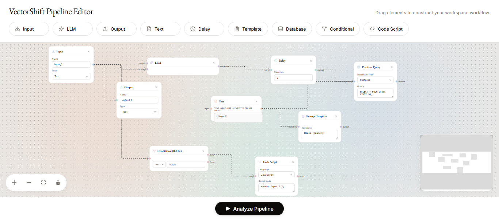

<div align="center">

# ⚡ VectorShift Pipeline Editor

**A visual drag-and-drop pipeline builder for constructing and analyzing AI workflows**



[](https://reactjs.org/)
[](https://fastapi.tiangolo.com/)
[](https://reactflow.dev/)
[](https://python.org/)

</div>

---

## 📖 Overview

VectorShift Pipeline Editor is a full-stack application that allows you to visually design and analyze AI pipelines. Drag, drop, and connect different node types on an interactive canvas to build complex workflows. When you're done, hit **Analyze Pipeline** to validate the structure and check if your pipeline forms a valid Directed Acyclic Graph (DAG).

---

## ✨ Features

- 🎨 **Visual Canvas** — Drag-and-drop nodes onto an infinite canvas powered by ReactFlow
- 🔗 **Connect Nodes** — Draw edges between nodes to define the data flow
- 🧩 **8 Node Types** — Input, Output, LLM, Text, Delay, Template, Database, Conditional, and Code Script nodes
- 🔍 **DAG Validation** — Backend analyzes the pipeline for cycles using Depth-First Search (DFS)
- 📊 **Pipeline Stats** — Get instant feedback: number of nodes, edges, and whether the graph is a valid DAG
- 🎯 **Resizable Text Nodes** — Text nodes auto-resize based on content with dynamic handle generation for `{{variable}}` references
- 💾 **State Management** — Zustand-powered global store for nodes and edges

---

## 🧩 Node Types

| Node | Description |
|------|-------------|
| **Input** | Entry point for data into the pipeline with configurable name and type |
| **Output** | Terminal node to capture pipeline output |
| **LLM** | Large Language Model processing node |
| **Text** | Text block with dynamic `{{variable}}` handle generation |
| **Delay** | Adds a configurable delay (in seconds) between operations |
| **Template** | Prompt template node with customizable content |
| **Database** | Query a database (PostgreSQL, MySQL, MongoDB, SQLite) |
| **Conditional** | Branching logic with If/Else flow control |
| **Code Script** | Execute custom scripts in JavaScript or Python |

---

## 🏗️ Project Structure

```
vectorshift/
├── backend/                  # FastAPI Python backend
│   ├── main.py               # API routes + DAG validation logic
│   └── package-lock.json
│
├── frontend/                 # React frontend
│   ├── public/
│   │   └── screenshot.png    # App preview image
│   ├── src/
│   │   ├── nodes/            # Individual node components
│   │   │   ├── BaseNode.js   # Reusable base node component
│   │   │   ├── inputNode.js
│   │   │   ├── outputNode.js
│   │   │   ├── llmNode.js
│   │   │   ├── textNode.js
│   │   │   ├── delayNode.js
│   │   │   ├── templateNode.js
│   │   │   ├── databaseNode.js
│   │   │   ├── conditionNode.js
│   │   │   └── scriptNode.js
│   │   ├── App.js            # Root component
│   │   ├── ui.js             # Main pipeline canvas
│   │   ├── toolbar.js        # Draggable node toolbar
│   │   ├── draggableNode.js  # Draggable node wrapper
│   │   ├── store.js          # Zustand state management
│   │   ├── submit.js         # Pipeline submission & result modal
│   │   └── index.css         # Global styles
│   ├── package.json
│   └── .gitignore
│
├── .gitignore                # Root gitignore
├── README.md                 # This file
└── package-lock.json
```

---

## 🚀 Getting Started

### Prerequisites

- **Node.js** v16+ and npm
- **Python** 3.8+
- **pip**

---

### ⚙️ Backend Setup

```bash
# Navigate to the backend directory
cd backend

# Install Python dependencies
pip install fastapi uvicorn pydantic

# Start the FastAPI server
uvicorn main:app --reload
```

The backend will run at **http://localhost:8000**

> API Docs available at: http://localhost:8000/docs

---

### 🎨 Frontend Setup

```bash
# Navigate to the frontend directory
cd frontend

# Install dependencies
npm install

# Start the development server
npm start
```

The frontend will run at **http://localhost:3000**

---

## 🔌 API Reference

### `GET /`
Health check endpoint.

**Response:**
```json
{ "Ping": "Pong" }
```

---

### `POST /pipelines/parse`

Analyzes a pipeline to count nodes/edges and check if it forms a valid DAG.

**Request Body:**
```json
{
  "nodes": [
    { "id": "node-1", "type": "inputNode", "data": {} }
  ],
  "edges": [
    { "id": "edge-1", "source": "node-1", "target": "node-2" }
  ]
}
```

**Response:**
```json
{
  "num_nodes": 3,
  "num_edges": 2,
  "is_dag": true
}
```

---

## 🛠️ Tech Stack

### Frontend
| Technology | Purpose |
|------------|---------|
| **React 18** | UI framework |
| **ReactFlow 11** | Interactive node-based canvas |
| **Zustand** | Lightweight state management |
| **Lucide React** | Icon library |

### Backend
| Technology | Purpose |
|------------|---------|
| **FastAPI** | High-performance Python API framework |
| **Pydantic** | Data validation and serialization |
| **Uvicorn** | ASGI server |

---

## 🔬 How the DAG Validation Works

The backend performs cycle detection using **Depth-First Search (DFS)**:

1. Constructs an **adjacency list** from the submitted edges
2. Tracks node visit state: `0 = Unvisited`, `1 = Visiting`, `2 = Fully Visited`
3. For each unvisited node, runs DFS and looks for **back edges** (an edge to a node currently in the DFS path)
4. If any back edge is found → **cycle detected** → `is_dag: false`
5. If no cycles found → `is_dag: true`

---

## 📸 Usage

1. **Drag** a node type from the top toolbar onto the canvas
2. **Connect** nodes by dragging from an output handle to an input handle
3. **Configure** each node using the fields in its panel
4. Click **Analyze Pipeline** to submit and validate the pipeline
5. View the results modal showing node count, edge count, and DAG status

---

## 🤝 Contributing

1. Fork the repository
2. Create a feature branch: `git checkout -b feature/amazing-feature`
3. Commit your changes: `git commit -m 'feat: add amazing feature'`
4. Push to the branch: `git push origin feature/amazing-feature`
5. Open a Pull Request

---

## 📄 License

This project is open-source. Feel free to use, modify, and distribute.

---

<div align="center">
Made with ❤️ using React + FastAPI
</div>
